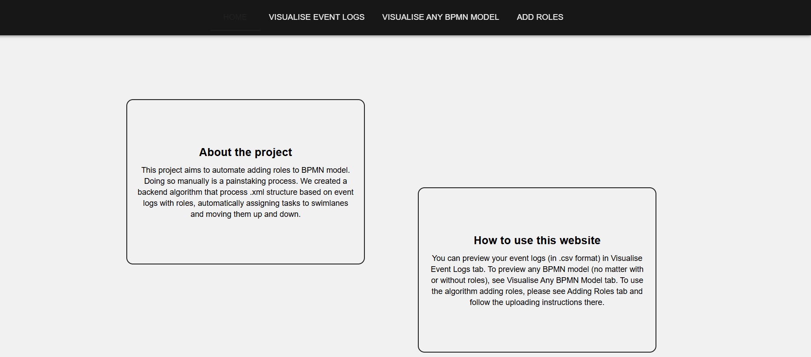
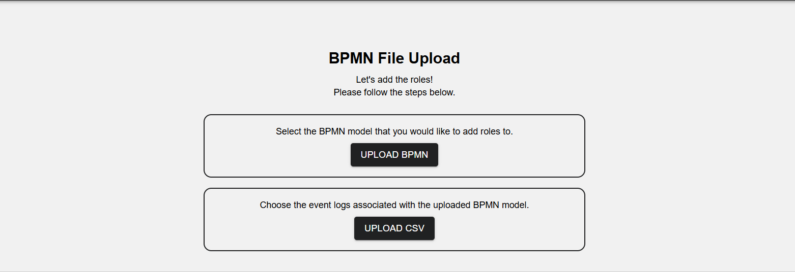
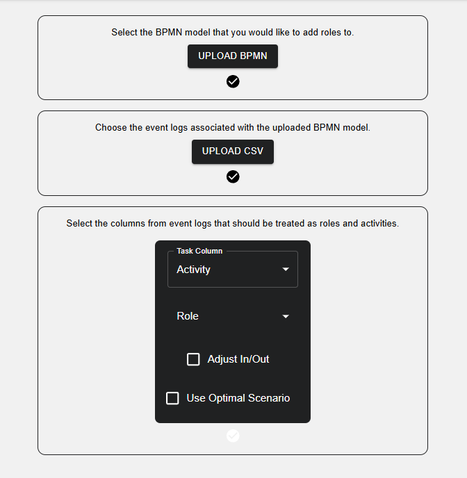
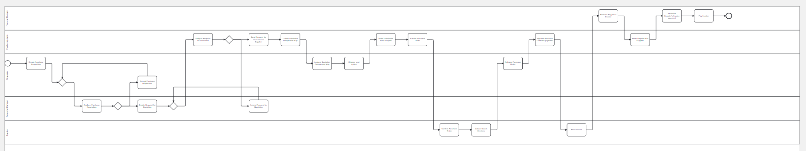

# BPMN Roles and Hierarchies

This project explores the automatic detection and updating of roles and organizational hierarchies in BPMN diagrams. The main goal is to support business process management by analyzing the organizational structure and role assignments within BPMN models. The project was developed as part of the course *Modeling and Analysis of Business Processes* in the Master's program in *Automatic Control and Robotics – IT in Control and Management* at AGH University of Krakow.  

## Project Objective
The automation of this process is based on event logs, which store information about the roles of individuals performing specific tasks. Based on these logs, a .bpmn model can be generated using tools such as Apromore. However, such models lack role information. By having a mapping of roles and their assigned tasks, it becomes possible to modify the model structure by adding swimlanes and repositioning elements accordingly.
To start working with the project, two types of files are required: event logs that contain role information (or allow it to be easily generated), and corresponding BPMN models. All other files and transformations are generated and carried out within the prepared application.

## Example Usage

1. After starting the server, you will see the homepage:  
   

2. Next, click the **Add Role** option. The following window will appear:  
   

3. Then, select the appropriate files from the `xml` and `logs` folders.  
   For example, choose `purchasingExampleRoles.bpmn` and `purchasingExample.csv`.  
   Select the appropriate roles and activities.  
   

4. Finally, click **Generate BPM Model with Roles** to generate the updated model:  
   

## 📁 Project Structure

- `frontend/` – the user interface for visualizing and editing BPMN diagrams.
- `backend/` – the server-side logic responsible for analyzing and updating roles and hierarchies in the diagrams.
- `xmls/` – sample BPMN files used for testing and demonstrating functionality.
- `logs/` – stores application logs.
- `.env.example` – an example configuration file for environment variables.

## 🧪 Sample BPMN Files

Sample BPMN diagrams used in this project are available from:  
👉 [https://processmind.com/resources/docs/example-files/bpmn-examples](https://processmind.com/resources/docs/example-files/bpmn-examples)

## 🚀 Running the Project

### Requirements

- Python 3.12+
- Node.js + npm
- Poetry (for Python environment and dependency management)

### Instructions

#### Backend (Python)

1. Install Poetry if you don't have it yet:  
   [https://python-poetry.org/docs/#installation](https://python-poetry.org/docs/#installation)

2. Install dependencies and activate the environment:  
   ```bash
   poetry install
   poetry shell
   ```

3. Start the backend server:  
   ```bash
   python main.py
   ```

#### Frontend (React/Node.js)

1. Navigate to the `frontend` directory:  
   ```bash
   cd frontend
   ```

2. Install dependencies and start the application:  
   ```bash
   npm install
   npm start
   ```

## 🧠 Features

1. Automatic detection of roles in BPMN diagrams.  
2. Support for importing and exporting BPMN diagrams in XML format.
